# Creando una Red Social

## Índice

* [1. Preámbulo](#1-preámbulo)
* [2. Resumen del proyecto](#2-resumen-del-proyecto)
* [3. Historias de usuario](#3-historias-de-usuardeio)
* [4. Diseño de la Interfaz de Usuario](#4-diseño-de-la-interfaz-de-usuario)
* [5. UX RESEARCH](#5-ux-research)

## 1. Preámbulo

Instagram, Snapchat, Twitter, Facebook, Twitch, Linkedin, etc. Las redes
sociales han invadido nuestras vidas. Las amamos u odiamos, y muchos no podemos
vivir sin ellas.

Hay redes sociales de todo tipo y para todo tipo de intereses. Por ejemplo,
en una ronda de financiamiento con inversionistas, se presentó una red social
para químicos en la que los usuarios podían publicar artículos sobre sus
investigaciones, comentar en los artículos de sus colegas, y filtrar artículos
de acuerdo a determinadas etiquetas o su popularidad, lo más reciente, o lo
más comentado.

## 2. Resumen del proyecto

En este proyectose desarrolló una Red Social que le permite a sus usuarios compartir recetas culinarias. 

La interfaz permite a cualquier usuario crear una cuenta de
acceso y loguearse con ella; crear, editar, borrar y _"likear"_ publicacciones.

El objetivo principal de aprendizaje de este proyecto es construir una
[Single-page Application (SPA)](https://es.wikipedia.org/wiki/Single-page_application)
[_responsive_](https://curriculum.laboratoria.la/es/topics/css/02-responsive) (con más de una vista / página)
en la que podamos **leer y escribir datos**.

## 3. Historias de usuario
UH 1. El usuario requiere registrarse e iniciar sesión con un correo electrónico que sea válido y contraseña. 
UH 2. El usuario quiere tener la opción de iniciar sesión, registrarse y validar su correo con Google. 
UH 3. El usuario quiere poder visualizar el muro y timeline de recetas al momento de iniciar sesión. 
UH 4. El usuario quiere postear sus recetas. 
UH 5. El usuario requiere borrar los post de sus recetas. 
UH 6. El usuario quiere poder editar sus post realizados anteriormente.
UH 7. El usuario puede visualizar los post que le gustan atravéz de un 'like' que puede dar o quitar y puede visualizarlos en un contador. 
UH 8. El usuario quiere poder mantener su sesión activa y dirigirse al muro directamente y cerrar sesion cuando asi lo requiera.

## 4. Diseño de la Interfaz de Usuario (prototipo de baja fidelidad)
Desarrollo del prototipo de baja fidelidad 
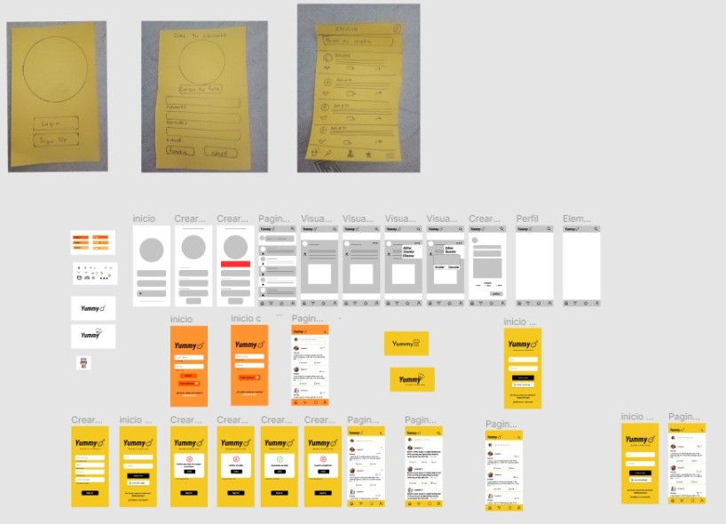

### 4.1 Responsive
A partir de la técnica de _`mobile first`_, la interfaz se ve adecuadamente en distíntos dispositivos desktop y móviles. 

PROTOTIPO ALTA FIDELIDAD VERSION MOBILE

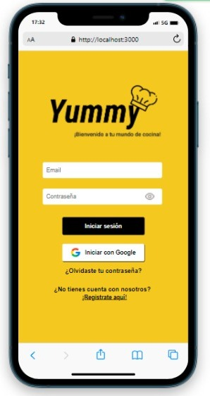
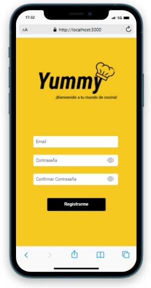
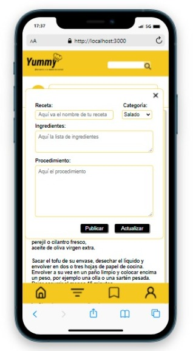
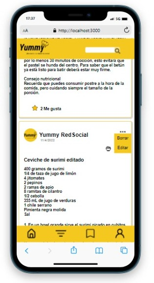
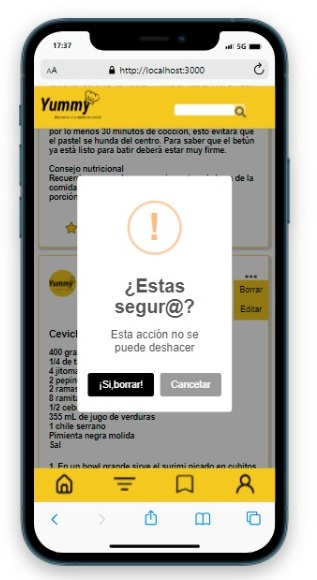

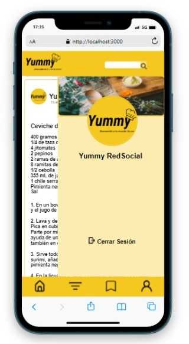
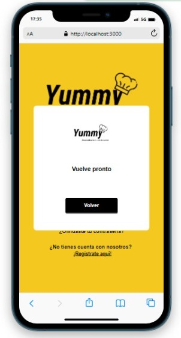

PROTOTIPO ALTA FIDELIDAD VERSION DESKTOP

[altaFidelidad1](src/images/inicioDesktop.jpeg)
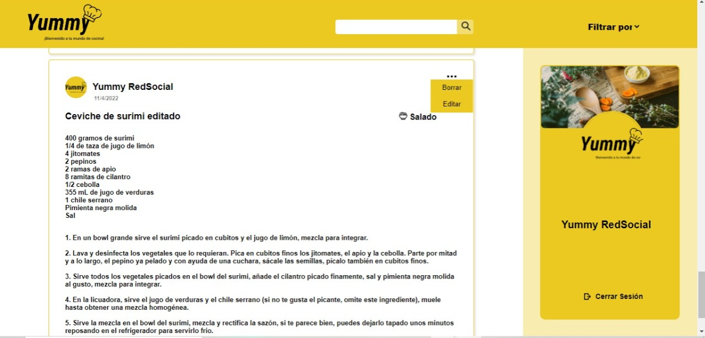
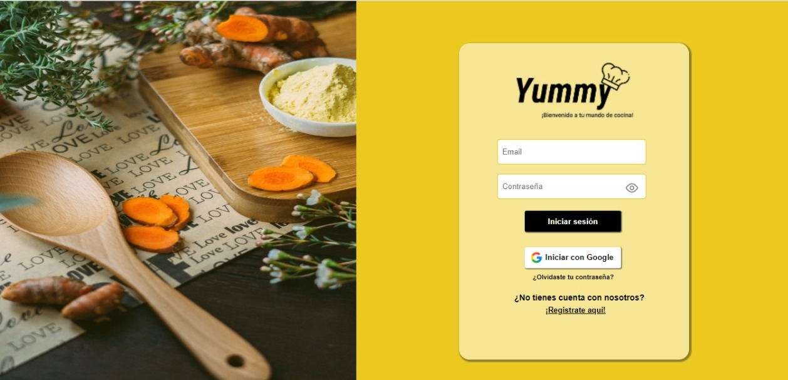
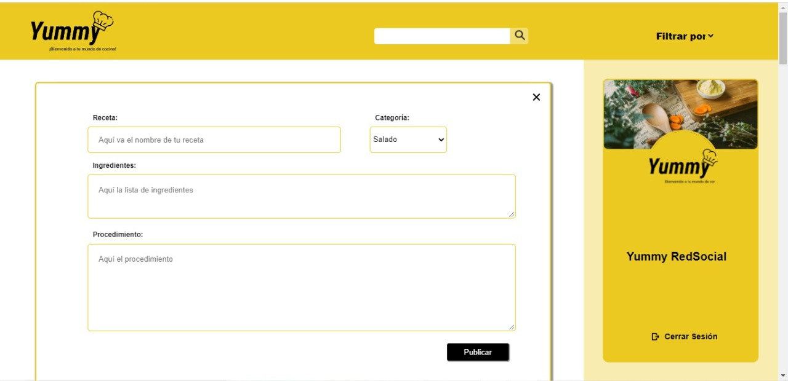
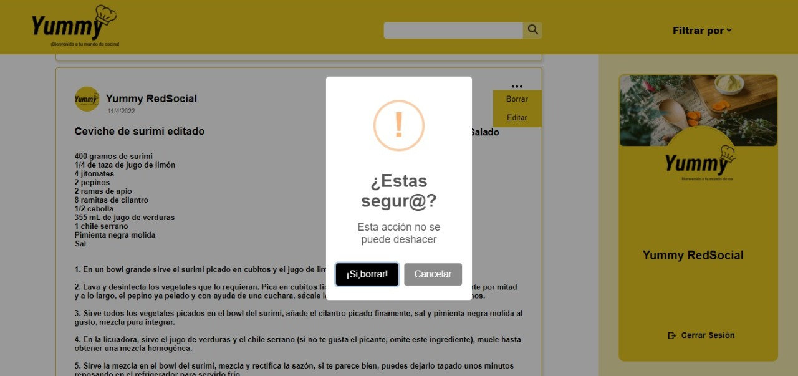
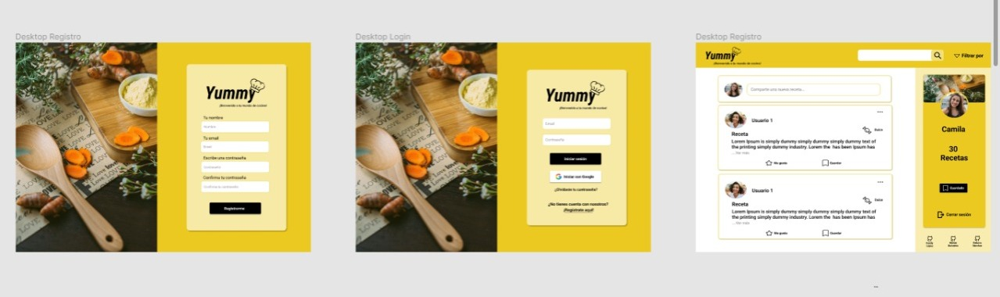

## 5. UX RESEARCH

Se realizó varias emojiEncuestas por Slack, asi como encuestas dentro de la comunidad del Cohort de Laboratoria y posibles usuarios, las cuales nos permitieron orientar tanto el diseño como la usabilidad de acuerdo a lo que los usuarios preferian/solicitaban, de esas encuestas se pudo rescatar los siguientes puntos en concreto:

-Manera de loguearse preferida : correo electronico y Google
-Acciones concretas que el usuario quiere hacer 
-Interfaz mas amigable hacia el usuario
-Identidad visual de la red social
-Distribución de la información en los Post 
